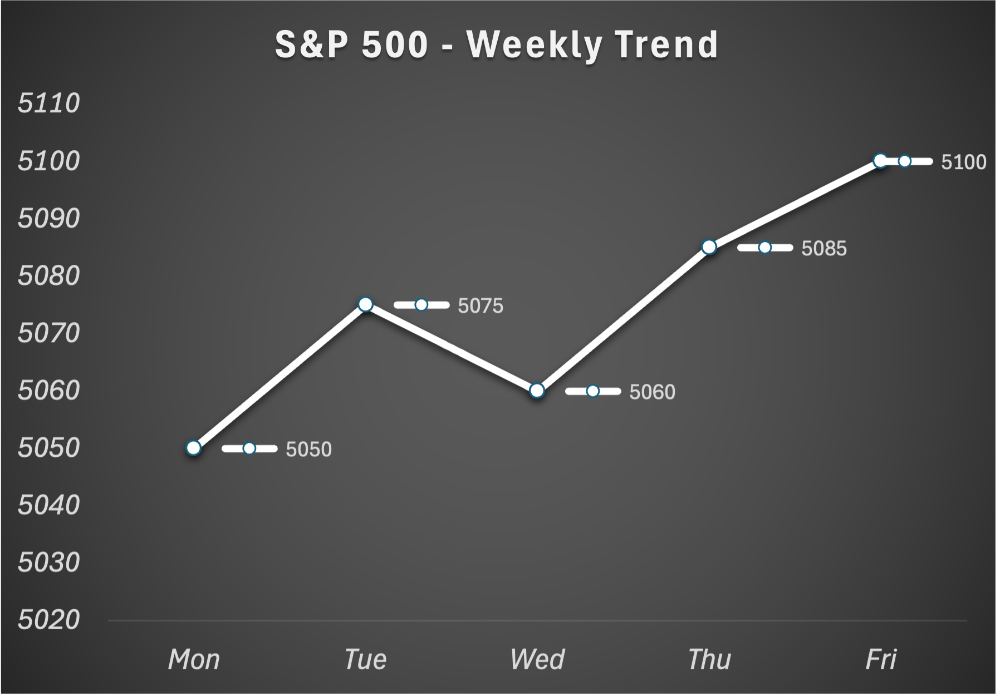
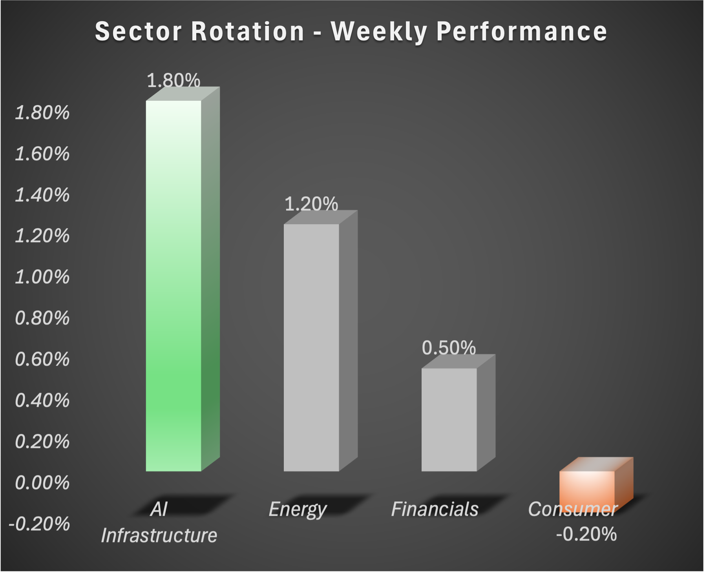

# Signal & Flow — Week 1

## 📊 Market Movement

## 🌊 Market Flow

## Since late February, I’ve been working on building a system to better understand markets—sourcing data, validating credibility, and breaking down complex concepts into structured and actionable information.
After weeks of analysis, research, and refining the process, I’m excited to introduce:
Signal & Flow — a weekly market brief focused on where capital (money) is moving and what that actually means. Releasing every Sunday at 9am EST.

## 🌊 Signal & Flow — by SW : Your Weekly Market Brief
Week 1 (April 21–25, 2026):
## • S&P 500 (broad U.S. stock market index): +1.2%
## • NASDAQ (technology-focused index): +1.8%
## • 10-Year Treasury Yield (benchmark interest rate): ~4.6% (rising)
## 📈 Signal
Strength remains concentrated in AI-driven sectors, even as interest rates (cost of borrowing) move higher.
→ Signal reflects what current market data is indicating about direction and momentum.
## 🌊 Flow
Capital is allocating into a narrow set of high-conviction areas—primarily AI infrastructure and energy—rather than broad market exposure.
→ Flow shows where money is actually being invested across sectors.
## 🎯 What this means
Market performance is selective, not uniform
Returns are being driven by a small number of dominant themes
Higher interest rates continue to impact everyday costs (credit cards, loans, housing), even alongside rising stock prices
## ’ll be publishing this weekly to continue refining how I analyze markets and connect data to real-world outcomes.

